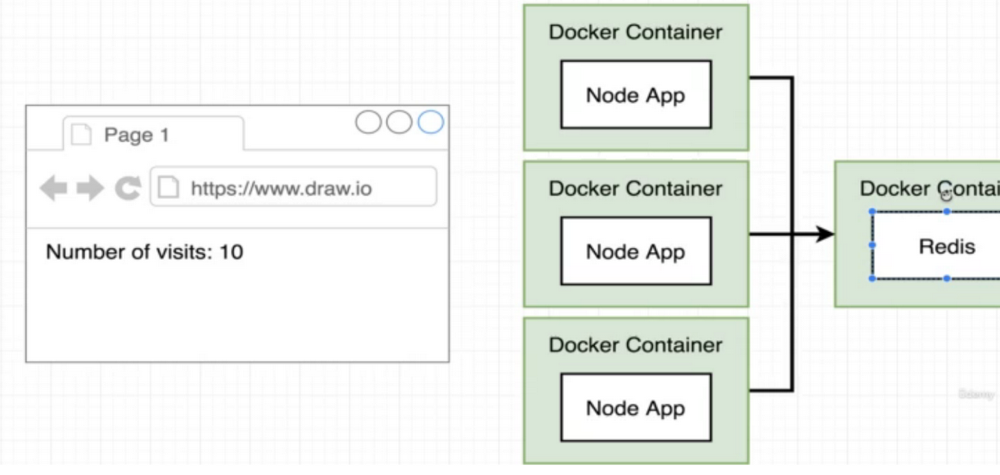

# docker-nodejs-hello-world
A simple nodejs app running on Docker container.

### Purpose of the app:
Count how many times somebody access the website. 

### Architecture:


The Node.js app and Redis run in different containers. This ensures the app can be scaled acording to website traffic and still maintan the corect data.

## Start project

Run the following 
```
npm install
```

```
docker-compose up   
```
To stop the project:
```
docker-compose down
```

## Usefull commands

See status of containers:
```
docker-compose ps 
```
If changes are made in the Node app:
```
docker-compose up -build 
```
